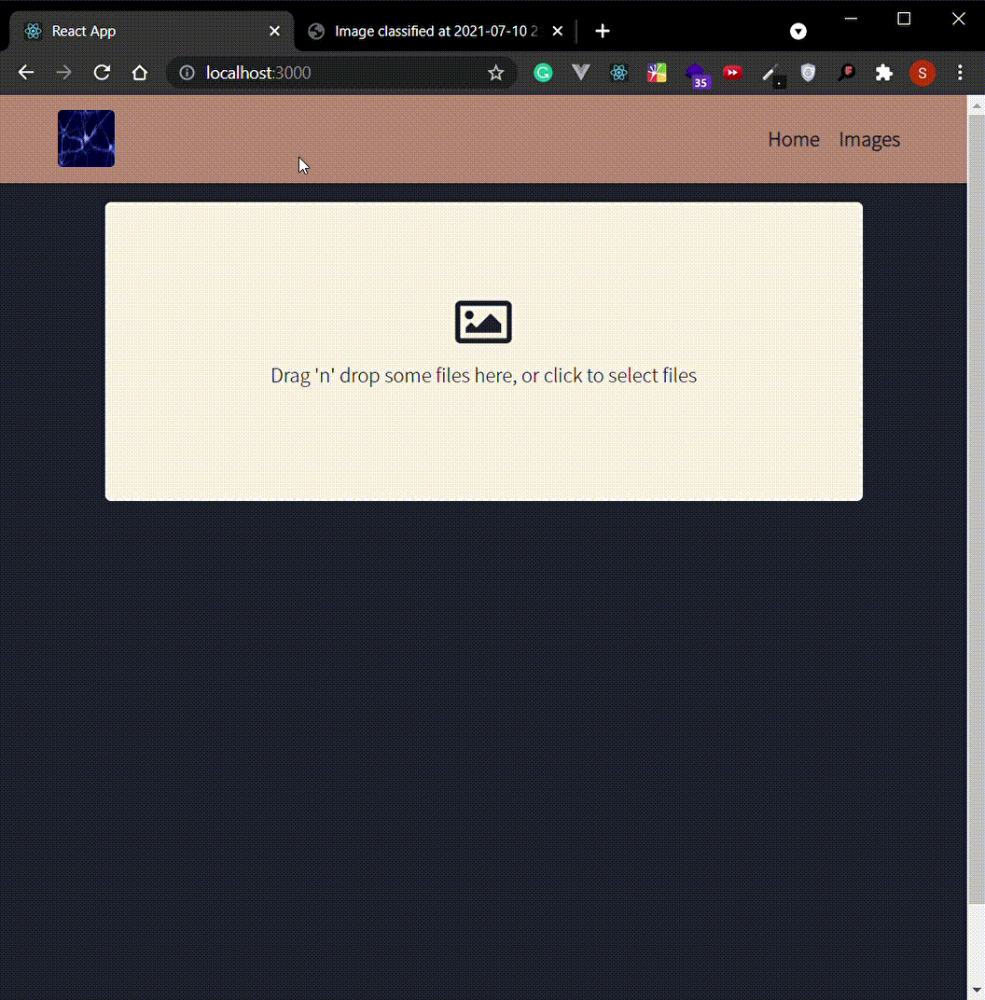
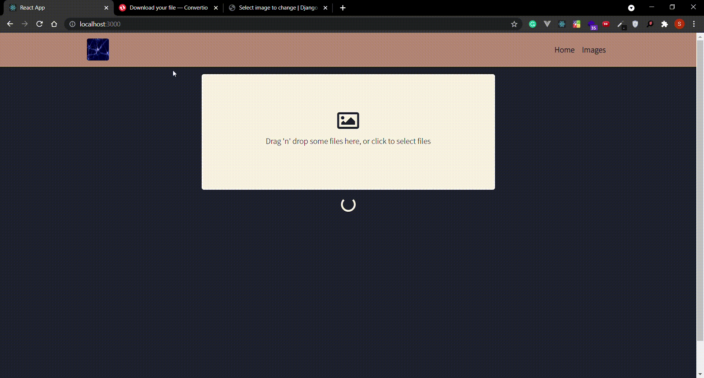
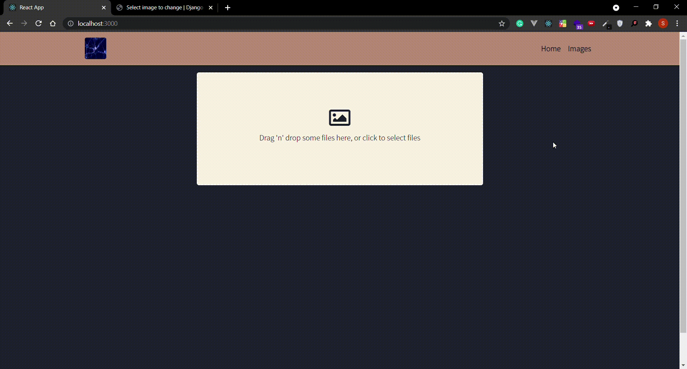

**Image Classification**
 

👉IMAGE UPLOAD 

👉CLASSIFIED RESULT 

👉UPLOAD NEXT IMAGE FOR CLASSIFICATION 

👉HISTORY 

**Description** 
"IMAGE CLASSIFICATION" is a single page web application developed with react and Django REST framework integrated with Keras Neural Network Model with Django. Backend is responsible for classifying images. Around 99% of results were correct.
